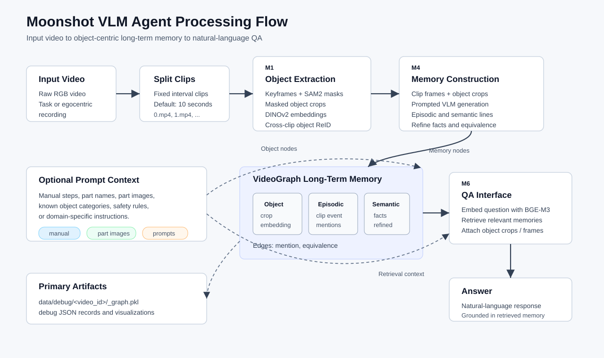

# Moonshot VLM Agent

Moonshot VLM Agent builds an object-centric long-term memory from egocentric videos, then exposes a question-answering interface over that memory.



Input: a raw RGB video, typically a first-person task video such as assembly, repair, or manipulation.

Output:

- A persistent `VideoGraph` memory containing objects, per-clip events, semantic facts, and object references.
- A QA interface that retrieves relevant memories and object crops, optionally combines them with current-scene frames, and answers natural-language questions.

## 1. Environment

Create an environment and install dependencies:

```bash
cd moonshot_VLM_agent

conda create -n moonshot-vlm-agent python=3.10 -y
conda activate moonshot-vlm-agent

pip install -r requirements.txt
```

Install SAM2 separately:

```bash
git clone https://github.com/facebookresearch/sam2.git
cd sam2
pip install -e .
cd ../moonshot_VLM_agent
```

Edit model paths in `configs/processing_config.json`:

```json
{
  "vlm_ckpt": "/path/to/Qwen3-VL-8B-Instruct_models",
  "sam2_ckpt": "/path/to/sam2.1-hiera-large_models/sam2.1_hiera_large.pt",
  "dinov2_ckpt": "/path/to/dinov2-large_models",
  "text_embed_ckpt": "/path/to/bge-m3_models"
}
```

If your CUDA runtime needs an extra library path, set:

```bash
export CUDA_LIB_DIR=/path/to/cuda/lib
```

## 2. Input And Output

The system expects videos split into fixed-length clips under:

```text
data/videos/<video_id>/0.mp4
data/videos/<video_id>/1.mp4
...
```

Split a source video:

```bash
scripts/split_video_clips.sh /path/to/input.mp4 <video_id> 0 10
```

After processing, the main artifact is a pickle graph:

```text
data/debug/<video_id>/_graph.pkl
```

This graph stores the long-term memory used by the QA interface.

## 3. Pipeline

### 3.1 Video Processing

Each video is processed as an ordered stream of clips. The default interval is 10 seconds.

For every clip, the object stage samples keyframes, runs SAM2 segmentation, extracts masked object crops, embeds them with DINOv2, and matches them against existing object nodes for cross-clip re-identification.

Run object extraction:

```bash
python scripts/run_m1_objects.py \
  --clips-dir data/videos/<video_id> \
  --debug-root data/debug/<video_id>
```

This writes an initial graph with object nodes:

```text
data/debug/<video_id>/_graph.pkl
```

### 3.2 Memory Construction

Memory construction uses the object graph plus sampled clip frames. For each clip, the VLM receives:

- sampled video frames from the clip;
- object crop tiles labeled as `<object_N>`;
- a memory-generation prompt.

It returns two lists:

- `episodic_memory`: concrete ordered events and object states in the clip;
- `semantic_memory`: durable facts, object types, task-level conclusions, and optional equivalence lines.

Run memory generation:

```bash
python scripts/run_m4_memories.py \
  --clips-dir data/videos/<video_id> \
  --graph data/debug/<video_id>/_graph.pkl \
  --save-graph data/debug/<video_id>/_graph.pkl \
  --records-dir data/debug/<video_id> \
  --fuse
```

### 3.3 Memory Data Structure

The memory is a `VideoGraph` with three node types:

- `object`: stores DINOv2 embeddings, representative masked crops, `seen_count`, `first_clip`, and `last_clip`.
- `episodic`: stores one concrete clip-level event line plus a BGE-M3 text embedding.
- `semantic`: stores one durable fact or conclusion plus a BGE-M3 text embedding.

Edges:

- `mention`: connects an episodic or semantic text node to referenced object nodes.
- `equivalence`: connects object IDs that the VLM identifies as the same physical object.

Semantic memory is refined during insertion:

- similar semantic facts about the same object set reinforce an existing semantic node;
- new facts are inserted as new semantic nodes;
- `Equivalence: <object_x>, <object_y>` lines update object identity groups and can be fused into canonical object nodes.

Useful inspection tools:

```bash
python scripts/debug/visualize_memory_graph.py \
  --graph data/debug/<video_id>/_graph.pkl \
  --out data/debug/<video_id>/_graph.html

python scripts/debug/visualize_clip_memories.py \
  --graph data/debug/<video_id>/_graph.pkl \
  --out data/debug/<video_id>/_clip_memories.html
```

## 4. Question Answering Interface

At query time, the system:

1. embeds the question with BGE-M3;
2. retrieves top matching episodic and semantic memory nodes;
3. collects object crops referenced by retrieved memories;
4. optionally samples frames from the current unfinished clip;
5. asks the VLM to answer using long-term memory, object features, and current-scene frames.

Memory-only QA:

```bash
python scripts/run_m6_qa.py \
  --graph data/debug/<video_id>/_graph.pkl \
  -q "What did the person pick up first?"
```

Streaming-style QA at time `N * 10 + k` seconds:

```bash
python scripts/run_m6_qa.py \
  --graph data/debug/<video_id>/_graph.pkl \
  -q "What tool am I holding right now?" \
  --max-clip 4 \
  --current-clip data/videos/<video_id>/5.mp4 \
  --short-term-seconds 3
```

Here `--max-clip 4` means long-term memory can only use finished clips `0..4`, while the first 3 seconds of clip `5.mp4` are treated as short-term current context.

## 5. Model Quality And API Recommendation

The current local VLM setup is useful for prototyping, but local models may be limited in:

- fine-grained action recognition;
- long-horizon temporal reasoning;
- distinguishing visually similar parts;
- following strict structured-output formats over many clips.

For a stronger public or production version, it is recommended to replace the local VLM calls in `mmagent/utils/qwen3vl_wrapper.py` with a high-quality multimodal API. The rest of the pipeline can stay the same: object extraction, graph writes, retrieval, and QA prompt assembly are separated from the VLM backend.

## 6. Adding Task Context To Prompts

The memory and QA prompts live in:

```text
mmagent/prompts.py
```

You can improve memory quality by adding task-specific context, for example:

- assembly manual steps;
- part names and part images;
- tool descriptions;
- expected workspace layout;
- known object categories;
- safety or domain constraints.

For richer multimodal context, extend the VLM input assembly in `mmagent/memory_processing.py` so the prompt can include extra reference images, such as part catalog images or annotated manual pages, alongside the detected `<object_N>` crops.

## 7. Common Debug Commands

Single-clip object debugging:

```bash
python scripts/debug/debug_m1_single_clip.py \
  --clip-path data/videos/<video_id>/0.mp4 \
  --clip-id 0 \
  --debug-root data/debug/<video_id>
```

Single-clip memory debugging:

```bash
python scripts/debug/debug_m4_single_clip.py \
  --clip-index 0 \
  --clips-dir data/videos/<video_id> \
  --graph data/debug/<video_id>/_graph.pkl
```

Similarity threshold diagnosis:

```bash
python scripts/debug/diagnose_similarity_matrix.py --clip-index 0
```
